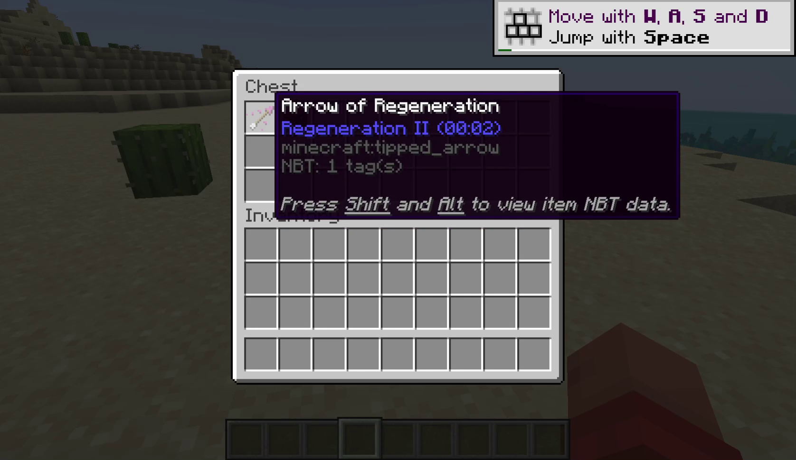
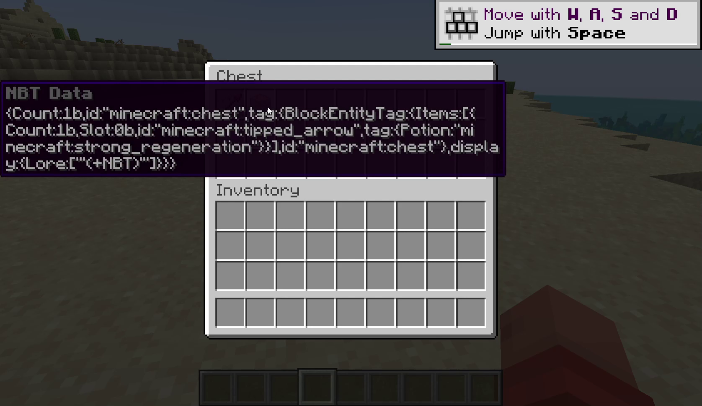

# NBT Viewer Mod

A client-side mod that allows you to view NBT data in item tooltips.

### Requirements

- Java 17
- Minecraft 1.20.1
- Fabric Loader 0.14.21 or higher.
- Fabric API 0.84.0 or higher.

### Usage

1. Make sure that you have advanced tooltips enabled. (`F3` + `H`)
2. Hover over an item in an inventory.
3. Hold the `Shift` and `Alt` keys to view the full NBT data of an item.

### Screenshots





### Compilation

Use the gradle wrapper to compile this project.

#### Windows:

```shell
> gradlew.bat clean build
```

#### Linux and Mac

```shell
$ ./gradlew clean build
```
